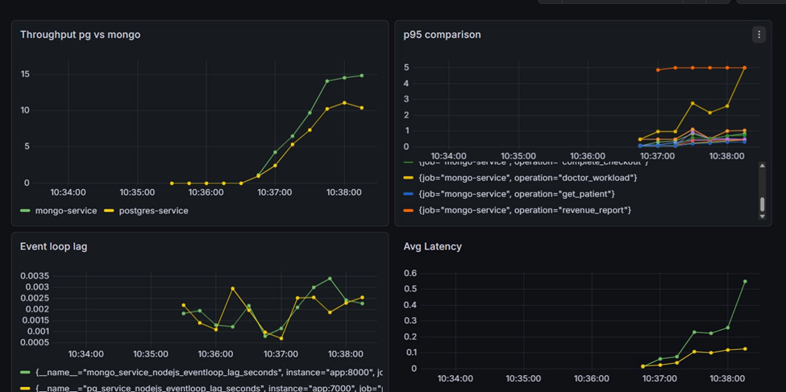

# PostgreSQL vs MongoDB Performance Benchmark

A comparative benchmarking project evaluating the performance of **PostgreSQL** and **MongoDB** under identical workloads. The project implements the same REST API using both databases and measures their behavior under concurrent load using industry-standard monitoring and load-testing tools.

> **Objective:** Compare latency, throughput, resource utilization, and scalability of relational and document databases using a consistent application layer.

---

# Project Overview

Two independent backend implementations expose identical REST endpoints:

* **PostgreSQL Backend**
* **MongoDB Backend**

Both services implement the same business logic, allowing performance differences to be attributed primarily to the underlying database.

Performance metrics are collected using **Prometheus**, visualized in **Grafana**, and stress-tested with **k6**.

---

# Features

## PostgreSQL

* User CRUD operations
* Product CRUD operations
* Order CRUD operations
* Transaction support
* Indexed queries
* Revenue aggregation

## MongoDB

* User CRUD operations
* Product CRUD operations
* Order CRUD operations
* Aggregation pipeline
* Indexed collections
* Revenue aggregation

---

# Benchmarking Stack

| Tool       | Purpose               |
| ---------- | --------------------- |
| Node.js    | Backend runtime       |
| Express.js | REST API              |
| PostgreSQL | Relational database   |
| MongoDB    | Document database     |
| Prometheus | Metrics collection    |
| Grafana    | Metrics visualization |
| k6         | Load testing          |

---

# Architecture

```text
                 k6 Load Generator
                        │
                        ▼
                 Express REST API
                  /            \
                 /              \
      PostgreSQL Backend    MongoDB Backend
             │                    │
             ▼                    ▼
       PostgreSQL DB         MongoDB
             │                    │
             └────────────┬────────────┘
                          ▼
                    Prometheus
                          │
                          ▼
                       Grafana
```

---

# API Modules

The benchmark implements three core entities.

## Users

* Create user
* Retrieve user
* List user orders

## Products

* Create product
* Retrieve product

## Orders

* Create order
* Retrieve order
* Update order status
* Delete order
* Revenue aggregation

Both database implementations expose identical endpoints.

---

# Metrics Collected

The benchmark evaluates:

* Request latency
* Requests per second (Throughput)
* Error rate
* Average response time
* 95th percentile latency
* CPU utilization
* Memory utilization
* Database query performance

---

# Load Testing

Load testing is performed using **k6**.

Typical scenarios include:

* Constant Virtual Users
* Ramp-up testing
* Stress testing
* Peak load testing

The same workload is executed against both implementations to ensure fair comparison.

---

# Monitoring

## Prometheus

Prometheus periodically scrapes metrics exposed by the application and database exporters.

Collected metrics include:

* HTTP request duration
* Request count
* CPU usage
* Memory usage
* PostgreSQL exporter metrics
* MongoDB exporter metrics

---

## Grafana

Grafana dashboards visualize:

* API latency
* Request throughput
* Database performance
* Resource utilization
* Error rates

---

# Repository Structure

```text
.
├── postgres/
│   ├── controllers/
│   ├── routes/
│   ├── models/
│   └── server.js
│
├── mongodb/
│   ├── controllers/
│   ├── routes/
│   ├── models/
│   └── server.js
│
├── k6/
│   ├── benchmark.js
│   └── scenarios/
│
├── prometheus/
│
├── grafana/
│
└── README.md
```

---

# Running the Project

Install dependencies:

```bash
npm install
```

Start the PostgreSQL backend:

```bash
npm run postgres
```

Start the MongoDB backend:

```bash
npm run mongodb
```

Run Prometheus:

```bash
prometheus
```

Run Grafana:

```bash
grafana-server
```

Execute load tests:

```bash
k6 run k6/benchmark.js
```
----
# Benchmark Results (V1)

The following results were collected using **k6** for load generation, **Prometheus** for metrics collection, and **Grafana** for visualization.

## Dashboard

<p align="center">
  
</p>


---

## Test Configuration

| Parameter | Value |
|-----------|-------|
| Concurrent Users | 50 Virtual Users |
| Dataset | 5,000 Users |
| Orders | ~20,000 |
| Products | ~15,000 |
| Additional Transactional Records | ~15,000 |
| Workload | CRUD Operations, Joins, Aggregations, Transactions |
| Monitoring | Prometheus + Grafana |
| Load Generator | k6 |

---

## Metrics Collected

- Throughput (Requests/sec)
- Average Latency
- P95 Latency
- Event Loop Lag

---

## Results

| Metric | MongoDB | PostgreSQL | Observation |
|---------|----------|------------|-------------|
| Throughput | ~14–15 req/s | ~10–11 req/s | MongoDB achieved approximately **35% higher throughput**. |
| Average Latency | ~500–550 ms | ~100–120 ms | PostgreSQL responded **4–5× faster** on average. |
| P95 Latency | Peaks up to ~5 s | Consistently below ~1 s | PostgreSQL maintained significantly more stable tail latency. |
| Event Loop Lag | ~0.0035 ms | ~0.0025 ms | PostgreSQL exhibited approximately **28% lower event loop lag**. |

---

## Analysis

### Throughput

MongoDB sustained a higher request rate throughout the benchmark, reaching approximately **15 requests/sec**, while PostgreSQL stabilized around **10–11 requests/sec**.

This suggests that MongoDB handled concurrent CRUD-heavy workloads more efficiently in terms of overall throughput.

---

### Average Latency

Despite the lower throughput, PostgreSQL consistently delivered much lower response times.

Average request latency remained close to **100–120 ms**, whereas MongoDB gradually increased to approximately **500–550 ms** under load.

---

### P95 Latency

Tail latency showed the most noticeable difference.

PostgreSQL maintained a relatively stable P95 latency below **1 second**, while MongoDB experienced spikes approaching **5 seconds** during heavier load.

This indicates PostgreSQL provided more predictable response times under stress.

---

### Event Loop Lag

Node.js event loop lag remained low for both implementations.

However, PostgreSQL consistently exhibited lower lag, averaging approximately **0.0025 ms** compared to MongoDB's **0.0035 ms**, suggesting slightly more efficient request processing.

---

## Limitations of V1

The first benchmark used **a single k6 script that invoked multiple API endpoints simultaneously**.

Although this provided an overall comparison between the two databases, it introduced several limitations:

- Performance characteristics of individual operations could not be isolated.
- CRUD, aggregation, and transaction workloads were mixed together.
- It was difficult to determine which API contributed most to latency spikes.
- Results represented aggregate system performance rather than operation-specific performance.

---

# V2 Benchmark (Current Work)

The second iteration of the benchmark addresses the limitations identified in V1.

## Improvements

- Separate k6 script for each API endpoint.
- Individual benchmarking of CRUD operations.
- Independent benchmarking of aggregation queries.
- Cleaner workload isolation.
- Smaller and more controlled dataset.
- Easier comparison of equivalent PostgreSQL and MongoDB operations.
- More reproducible benchmark results.

The objective of V2 is to evaluate database performance **at the operation level**, allowing each endpoint to be analyzed independently instead of aggregating multiple workloads into a single benchmark.

---

# Benchmark Goals

This project aims to compare both databases with respect to:

* Read performance
* Write performance
* Concurrent request handling
* Aggregation query performance
* Resource utilization
* Scalability under load

---

# Future Improvements

* Docker Compose deployment
* Automated benchmark pipeline
* Additional workload scenarios
* Horizontal scaling experiments
* Replication and sharding benchmarks
* Time-series benchmark reporting

---

# License

MIT
